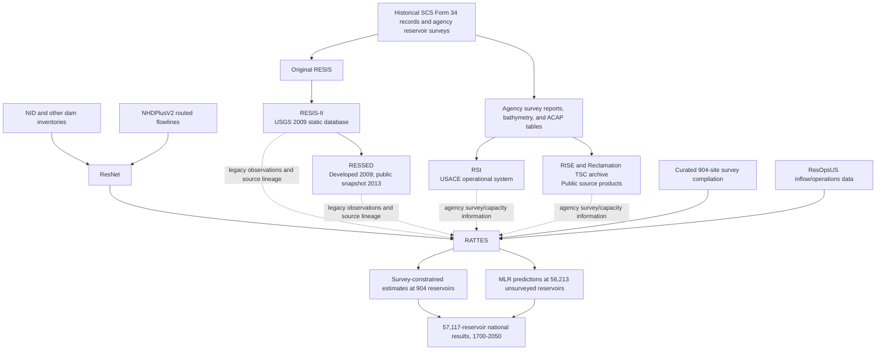

# Guide to U.S. Reservoir Sedimentation Data, Survey Systems, Network Data, and National Models

## RESIS-II, RESSED, RSI, RISE, ResNet, RATTES, and supporting sources

**Prepared:** August 29, 2026  
**Availability status checked:** August 29, 2026  
**Geographic emphasis:** Conterminous United States, with some sources covering Puerto Rico, U.S. territories, Canada, Mexico, or the globe

---

## Executive summary

Several resources used in reservoir sedimentation work have similar names but serve fundamentally different purposes. They should not be treated as interchangeable databases.

> **The one-sentence distinction:** RESIS-II and RESSED compile historical reservoir surveys; RSI is the current USACE operational sediment-information system; RISE and the Reclamation Technical Service Center archive distribute Reclamation's survey products; ResNet supplies a routed reservoir network; and RATTES uses survey information plus that network to estimate sedimentation across tens of thousands of reservoirs.

The most important points are:

1. **RESIS-II and RESSED are observational archives.** Their core records come from actual bathymetric, topographic, and reservoir-capacity surveys. The public RESSED data are old: the readily downloadable national snapshot is dated **April 26, 2013**, and most of its foundational surveys were conducted between **1930 and 1990**.
2. **RSI is an operational federal information system, not an openly downloadable national dataset.** USACE developed it to store and display reservoir-condition information and evaluate sediment accumulation trends, reservoir life expectancy, and vulnerabilities. Its public landing page exists, but access to the operational system requires authentication and authorization.
3. **RISE is Reclamation's public data-distribution environment.** It is not a sedimentation-only database. For reservoir sedimentation, it provides public access to individual survey reports, area-capacity tables, and geospatial files. A 2023 pilot placed data from **95 reservoirs** into RISE, and additional products continue to be published.
4. **ResNet is a national reservoir-network dataset.** It routes storage reservoirs from upstream to downstream on NHDPlusV2 flowlines. It provides the network context needed to determine which reservoirs are connected and how upstream dams reduce sediment-contributing drainage area. It does **not** contain measured sedimentation histories for all reservoirs and does **not** independently model ongoing capacity loss.
5. **RATTES is a national modeling framework, not a direct replacement for RESSED.** The 2026 study uses **904 survey-constrained reservoirs** and predicts sedimentation at **56,213 unsurveyed reservoirs**, producing results for **57,117 reservoirs** over the modeled period **1700–2050**.
6. **Measured and modeled values must remain visibly distinct.** A survey-derived capacity change is an observation subject to survey-method and datum limitations. A RATTES value at an unsurveyed reservoir is a statistical/model estimate subject to model assumptions and uncertainty.

A useful conceptual hierarchy is:

- **Original evidence:** survey reports, bathymetry, topography, and area-capacity tables
- **Curated observational systems:** RESIS-II, RESSED, RSI, and RISE catalog records
- **Infrastructure and network context:** NID, NHDPlusV2, and ResNet
- **Modeled national estimates:** RATTES

---

## 1. Why the dates can be confusing

Each resource can have several different kinds of dates. These should be reported separately.

### 1.1 Survey or observation year

The year in which a bathymetric, topographic, capacity, storage, inflow, or operational measurement was made. For example, RESIS-II contains survey information spanning **1755–1993**, even though RESIS-II was not published until 2009.

### 1.2 Compilation or production year

The year in which records were assembled, quality-controlled, transformed, linked, or modeled. A dataset may be produced from much older observations.

### 1.3 Publication or public-release year

The year in which the database, report, static snapshot, code repository, or model results were made publicly available. The **2013** date associated with RESSED is principally a public snapshot date—not the date when most surveys were performed.

### 1.4 Version or input-data vintage

The dated version of an upstream input used to create another product. For example:

- The peer-reviewed ResNet version used the **July 2024 NID**.
- The living ResNet GitHub repository was updated using the **March 4, 2026 NID**.
- NHDPlusV2 was released in **2012** from medium-resolution hydrography snapshots around **2011–2012**.

### 1.5 Model time horizon

The historical and future years for which a model generates estimates. RATTES produces results for **1700–2050**, but that does not mean there are direct observations for every reservoir and every year in that interval.

### 1.6 Access date

Dynamic portals and repositories can change. Statements about current availability in this guide reflect what was verifiable on **August 29, 2026**.

---

## 2. Master comparison: what each source is

| Resource | Primary organization or developers | Resource type | Main content | Observed, derived, or modeled? | Geographic scope | Core role |
|---|---|---|---|---|---|---|
| **RESIS-II** | USGS; based on earlier Soil Conservation Service and Texas Agricultural Experiment Station records | Static relational database and USGS Data Series | Historical reservoir bathymetric/topographic surveys and capacity information | **Observed survey records**, with compiled metadata | Primarily conterminous U.S. | Historical national survey archive and predecessor to RESSED |
| **RESSED** | ACWI Subcommittee on Sedimentation; USGS, NRCS, USACE, and Reclamation participation | Legacy reservoir-sedimentation survey database and web download | Survey records, capacities, dates, reservoir descriptors, scanned source forms | **Observed survey records**, with calculated capacity changes possible | U.S.; includes limited Puerto Rico records | National historical survey compilation; empirical reference data |
| **RSI** | USACE, with Reclamation participation in data stewardship | Operational enterprise web/database system | Reservoir-condition summaries, capacity/survey information, trends, life expectancy, vulnerabilities | Primarily **observational and calculated from surveys** | Primarily USACE and collaborating reservoir portfolios | Current operational federal sediment-information management |
| **RISE** | Bureau of Reclamation | General public open-data portal and catalog | Survey reports, ACAP tables, DEMs, point data, contours, and related files | **Observed/source products** | Primarily Reclamation projects in the western U.S. | Public distribution of Reclamation's underlying survey products |
| **Reclamation TSC survey archive** | Bureau of Reclamation Technical Service Center | Public report and GIS file archive | Reservoir sedimentation survey reports, ACAP tables, and GIS data | **Observed/source products** | Reclamation reservoirs | Direct access to individual Reclamation survey products |
| **NID** | USACE | National dam-infrastructure inventory | Dam location, owner, purpose, height, storage, hazard, completion year, and related attributes | Mostly **reported inventory attributes** | United States and territories | Dam identity and infrastructure attributes; not a sedimentation database |
| **NHDPlusV2** | EPA and USGS partnership | National hydrologic geospatial network | Routed stream reaches, catchments, flow attributes, and network identifiers | **Derived geospatial framework** | CONUS plus additional U.S. areas depending on component | River-network routing framework used by ResNet |
| **ResNet** | Aaron Hurst, Melissa Foster, and Abigail Eckland; Reclamation-supported research | Routed national reservoir-network dataset and reproducible workflow | Storage reservoirs linked upstream-to-downstream, crosswalks, storage, completion year, drainage area, and sediment-contributing drainage area | Inventory data plus **derived network attributes** | Conterminous U.S. | Network context for sediment trapping, connectivity, storage, and downstream impacts |
| **RATTES** | Abigail Eckland, Melissa Foster, Aaron Hurst, Mussie Beyene, and Irina Overeem; Reclamation-supported research | National sedimentation model, model outputs, and reproducibility package | Historical and projected capacity, sediment accumulation, trap efficiency, and delta-related outputs | **Survey-constrained modeling at 904 sites; statistical predictions at 56,213 sites** | Conterminous U.S. | National inference of sedimentation where surveys do not exist |
| **ResOpsUS** | Steyaert, Condon, Turner, and Voisin | Historical reservoir-operations dataset | Daily inflow, outflow, storage, elevation, and evaporation | **Observed operational time series** | Major reservoirs in CONUS and limited upstream Canadian locations | Supporting inflow/operations data; used by RATTES for trap-efficiency comparisons |

---

## 3. Master comparison: dates, versions, and public availability

| Resource | Years represented by the data | Production or compilation vintage | Publication or public-release date | Status as of August 29, 2026 | Public availability |
|---|---|---|---|---|---|
| **RESIS-II** | Survey records from **1755–1993**; 95% of surveys occurred **1930–1990** | Cleaned and assembled before its 2009 release | **March 10, 2009**, USGS Data Series 434, Version 1.0 | Static historical database | **Yes.** Public report and Microsoft Access database |
| **RESSED** | Foundational records **1755–1993**; a March 2010 description reported records through **1997**; USACE/Reclamation additions began in **FY2012** | Developed from RESIS-II in **March–April 2009**; modernized and augmented afterward | Website/database introduced in **2009**; major public interim snapshot dated **April 26, 2013**; site pages last modified in **April 2014** | Legacy public snapshot; no later national public snapshot was verified | **Yes, but static/legacy.** XML, JSON, Access database, scanned forms, and Data Explorer; data labeled provisional |
| **RSI** | Site-specific survey histories; no single national observation-year range is publicly stated | USACE system existed by **2016**; Reclamation stewardship/integration project funded **FY2016–FY2017** | Reclamation project final product completed **September 30, 2017** | Current operational portal observed as **PROD v2.8** | **Restricted.** Public landing page, but operational access uses Login.gov and USG authorization; no anonymous bulk national download verified |
| **RISE sedimentation records** | Varies by reservoir and product; includes historical and modern surveys | Open-data pilot assembled records for **95 reservoirs** by 2023; continuing item-by-item publication | Pilot final report published **October 31, 2023**, updated **November 16, 2023**; individual records continue through 2026 | Active public catalog | **Yes.** Public downloads and catalog/API access, generally by reservoir and product |
| **Reclamation TSC archive** | Public page includes surveys from at least **1948 through 2024** | Built incrementally from Reclamation survey products | No single publication date; active archive available in 2026 | Active public archive | **Yes.** Reports, tables, and many GIS files are public |
| **NID** | Current inventory attributes; individual dam completion years span many decades | Created in the **1970s**; continuously maintained | Ongoing national system rather than one publication | Live portal displayed **92,678 dams** when checked; ResNet v1 used July 2024 NID and the living ResNet update used March 4, 2026 NID | **Yes.** Public search, map, downloads, and GIS services |
| **NHDPlusV2** | Based on medium-resolution NHD/WBD snapshots from roughly **2011–2012** | Developed in the early 2010s | Released in **2012**; Version 2.1 is the commonly used minor version | Static legacy network still broadly used | **Yes.** Public downloads; not an actively modernized stream network |
| **ResNet static v1** | Dam attributes largely reflect input datasets available in **2024**, including July 2024 NID; includes **SCA2025** | Produced during **2024–2025** | Article published **November 27, 2025**; Version of Record **December 30, 2025** | Peer-reviewed static v1 on Zenodo | **Yes.** Static data/input files on Zenodo; code on public GitHub |
| **ResNet living repository** | Depends on current input versions | Updated with **March 4, 2026 NID** and revised attributes | GitHub update documented **March 4, 2026** | Living/reproducible dataset | **Yes.** Public GitHub; MIT license shown by repository |
| **RATTES** | Model results cover **1700–2050**; principal reported benchmarks are **2025** and **2050**; survey-year pairs vary by site and have at least a 10-year interval in the published workflow | Model and reproducibility package produced during **2025–2026**; GitHub repository created June 2026 and updated July 2026 | Paper published **August 25, 2026**; accepted August 10, 2026 | Early citable peer-reviewed article pending final Version of Record when checked | **Yes.** Open-access article and supplements, public GitHub, and Zenodo records; distinguish public visibility from code-license terms |
| **ResOpsUS** | Daily observations spanning **1930–2020**, with strongest coverage **1980–2020** | Compiled before publication in 2022 | Published **February 3, 2022** | Static published dataset, Version 1.1 referenced | **Yes.** Public Zenodo dataset and open-access paper |

### Important qualification on “latest year” for RESSED

The precise most recent survey year contained in the **April 26, 2013 XML/JSON export** is not clearly summarized on the public USGS landing page. The most defensible statements are:

- The RESIS-II foundation spans **1755–1993**.
- A March 2010 RESSED description reports data spanning **1755–1997**.
- Additional USACE and Reclamation capacity data began being added in **FY2012**.
- The publicly downloadable interim snapshot is dated **April 26, 2013**.

Therefore, the snapshot date should not be used as a blanket claim that every record is current through 2013.

---

## 4. How the resources relate to one another

### Text version of the lineage

1. **Historical survey information** was first assembled through the original RESIS system and then cleaned and published as RESIS-II in 2009.
2. **RESSED** extended that legacy archive, modernized its structure, and added agency information. The readily downloadable public national snapshot is from 2013.
3. **RSI** developed as a more adaptable USACE enterprise system. Reclamation funded a 2016–2017 effort to quality-control and integrate Reclamation information into RSI.
4. **RISE and the Reclamation TSC archive** provide public access to survey reports, ACAP tables, and geospatial products that may underlie or complement database records.
5. **NID and NHDPlusV2** provide dam attributes and the routed stream network.
6. **ResNet** places storage reservoirs on that stream network and determines upstream/downstream connections.
7. **RATTES** combines a curated survey dataset with ResNet and supporting information to estimate sedimentation over time at both surveyed and unsurveyed reservoirs.

The dashed relationships in the diagram are intentionally cautious: the RATTES paper identifies survey sources in its Supplementary Data 1 file, but it should not be assumed that every one of the 904 survey records was taken directly from the public 2013 RESSED export.

---

# Detailed resource descriptions

## 5. RESIS-II

### 5.1 What it is

**RESIS-II** means the updated version of the original **Reservoir Sedimentation Survey Information System**. It is a USGS Data Series product and a Microsoft Access relational database.

The original RESIS information was compiled by the Soil Conservation Service—now the Natural Resources Conservation Service—in collaboration with the Texas Agricultural Experiment Station. RESIS-II improved the original database, including more precise reservoir coordinates for many records.

### 5.2 Data years and scale

RESIS-II contains:

- **1,823 reservoirs**
- **6,617 bathymetric surveys**
- Survey information from **1755 through 1993**
- Approximately **95%** of surveys conducted between **1930 and 1990**

This is a critical example of why the publication year and observation year must be separated: RESIS-II was published in 2009, but its observations are mostly much older.

### 5.3 Publication and availability

- **Published:** March 10, 2009
- **Product:** USGS Data Series 434, Version 1.0
- **DOI:** [10.3133/ds434](https://doi.org/10.3133/ds434)
- **Availability:** Public report and downloadable Microsoft Access database
- **Update status:** Static historical product

### 5.4 Best uses

Use RESIS-II to:

- Analyze historical reservoir sedimentation-survey records.
- Trace the original data foundation inherited by RESSED.
- Reconstruct long-term empirical capacity changes where survey records are sufficient.
- Review older SCS/NRCS reservoir-survey data in a structured format.

### 5.5 Limitations

- Most surveys are several decades old.
- Survey methods, vertical datums, and measurement quality are heterogeneous.
- Watershed land-use metadata are limited.
- It is not comprehensive relative to the number of U.S. dams.
- It is static and does not represent current reservoir conditions.

---

## 6. RESSED

### 6.1 What it is

**RESSED** is the **REServoir SEDimentation survey information database**, also commonly described by USGS as the Reservoir Sedimentation Database.

It was developed by the Advisory Committee on Water Information's Subcommittee on Sedimentation, with participation from USGS, NRCS, USACE, Reclamation, and other partners. It evolved directly from RESIS-II and was intended to become a dynamic, quality-assured national repository of reservoir survey information.

### 6.2 What the data represent

RESSED contains observational survey information such as:

- Reservoir identity and descriptive attributes
- Survey dates
- Capacity and area information
- Historical changes in reservoir storage
- Scanned SCS Form 34 source sheets for many reservoirs
- Reservoir owner and purpose information where available

Repeated capacity surveys can be used to estimate:

- Accumulated sediment volume
- Average annual capacity-loss rate
- Specific sediment yield, subject to watershed-area and trapping assumptions
- Changes in elevation-area-capacity relationships

### 6.3 Key dates

- **March–April 2009:** RESSED developed from RESIS-II and its public website introduced.
- **March 2010:** A published status description reported 6,616 U.S. surveys at 1,823 reservoirs, two Puerto Rico surveys, and data spanning 1755–1997.
- **FY2012:** USACE and Reclamation began adding additional reservoir-capacity information.
- **April 26, 2013:** Public interim RESSED export made available in XML and JSON.
- **April 2014:** Key public website pages show their last modification date.

### 6.4 Public availability in 2026

The legacy public products remain available:

- XML export
- JSON export
- Data Explorer source and web application
- Older Microsoft Access database
- Interactive map and reservoir list
- Scanned data sheets

However, the public USGS site also states that direct public updating and retrieval from the production FileMaker database were restricted to Subcommittee member organizations. A newer public national snapshot than the April 2013 export was not verified as of August 29, 2026.

Therefore, RESSED is best described as:

> **A publicly accessible but legacy and largely static national archive of reservoir-sedimentation surveys, not a current continuously updated public operational database.**

### 6.5 Best uses

Use RESSED to:

- Find historical reservoir survey and capacity information.
- Identify reservoirs with repeated surveys.
- Develop empirical sedimentation-rate samples.
- Validate or train regional/national sedimentation models.
- Locate original SCS data sheets and understand legacy data provenance.

### 6.6 Limitations

- The public snapshot is old.
- Most foundational surveys occurred before 1990.
- Records may contain geolocation, transcription, datum, and architecture issues.
- Some reservoir purpose and owner fields are incomplete.
- The database is provisional and subject to revision.
- A capacity difference may reflect sediment accumulation, but also potentially survey-method changes, datum changes, dam modifications, dredging, or revised stage-storage relationships.

### 6.7 Public links

- [USGS RESSED home page](https://water.usgs.gov/osw/ressed/)
- [2013 RESSED database download and documentation](https://water.usgs.gov/osw/ressed/db_doc2013/index.html)
- [2013 XML/JSON downloads](https://water.usgs.gov/osw/ressed/download2013/index.html)
- [RESSED Data Explorer](https://water.usgs.gov/osw/ressed/data_explorer/index.html)

---

## 7. RSI: USACE Reservoir Sedimentation Information

### 7.1 What it is

**RSI** is the USACE **Reservoir Sedimentation Information** system. The current portal is titled **Enhancing Reservoir Sedimentation Information**.

The system is designed to store and display reservoir information so USACE can evaluate:

- Reservoir condition
- Sediment accumulation trends
- Life expectancy
- Capacity depletion
- Vulnerabilities and management priorities

### 7.2 Relationship to RESSED

RSI is related to RESSED, but it should not simply be called “RESSED Version 2.” It was developed as a separate USACE enterprise system with a more adaptable, updateable Oracle-based architecture.

Reclamation's **Reservoir Sedimentation Information Database Stewardship** project documented the practical transition problem:

- Reclamation survey data were available in public RESSED.
- Reclamation staff could not readily add new surveys after 2010.
- Some Reclamation records had data-entry errors.
- USACE had developed RSI as a more powerful and updateable system.
- Reclamation funded stewardship and integration work during FY2016 and FY2017.

### 7.3 Key dates

- **By 2016:** USACE had developed RSI sufficiently for Reclamation to pursue collaboration and data integration.
- **FY2016–FY2017:** Reclamation funded Project 8988 for database stewardship.
- **September 30, 2017:** Reclamation final research product completed.
- **August 2026:** Current public landing page identified the production environment as **PROD v2.8**.

### 7.4 Public availability in 2026

The portal landing page is publicly reachable, but:

- Authentication is handled through Login.gov.
- The site states that it is a U.S. Government information system for authorized use.
- An anonymous national bulk-data download was not verified.

Thus, its availability should be described as:

> **Operational and current, but authenticated/restricted—not an open public national download comparable to RESSED's XML/JSON export.**

### 7.5 Best uses

For authorized users, RSI is the logical source for:

- Current USACE reservoir-condition summaries
- Enterprise-level sedimentation tracking
- Survey and capacity histories maintained by USACE
- Reservoir life and vulnerability assessments
- Portfolio prioritization

### 7.6 Public links

- [USACE RSI portal](https://cwbi-app.sec.usace.army.mil/rsi)
- [Reclamation Project 8988: Reservoir Sedimentation Information Database Stewardship](https://www.usbr.gov/research/projects/detail.cfm?id=8988)

---

## 8. RISE and Reclamation's public survey products

## 8.1 What RISE is

**RISE** is the **Reclamation Information Sharing Environment**, Reclamation's public data catalog and open-data environment. It supports many water-resource topics; reservoir sedimentation is only one category.

For sedimentation work, RISE may provide:

- Final reservoir sedimentation survey reports
- Area-capacity, or ACAP, tables
- Bathymetric and topographic surfaces
- Survey points
- Contours
- Digital elevation models
- Metadata describing survey methods, dates, datums, and processing

### 8.2 The 2023 open-data pilot

Reclamation's Open Data Pilot for integrating river and reservoir topographic and sediment data into RISE:

- Added sedimentation-survey information for **95 reservoirs**.
- Developed guidance for publishing survey reports, ACAP tables, and geospatial data.
- Published its final report on **October 31, 2023**.
- Updated the catalog item on **November 16, 2023**.

The number 95 describes the pilot effort; it should not automatically be treated as the total number of sedimentation records currently available in RISE.

### 8.3 Continuing publication examples

RISE is an active catalog with separate dates for the field survey, report, data publication, and later metadata update. Examples include:

- **Pueblo Reservoir:** survey conducted in 2023; geospatial item published January 1, 2025; catalog updated June 12, 2026.
- **Lake Mohave:** survey conducted in 2022; ACAP item published October 1, 2025; updated December 8, 2025.
- Other survey records may have historical survey dates but much later digital-publication dates.

These examples show why a single “data year” is insufficient.

### 8.4 Reclamation Technical Service Center archive

Reclamation also maintains a public Technical Service Center reservoir-survey page. As checked in August 2026, it listed reports and files with survey dates ranging from at least:

- **Arrowrock Reservoir, 1948**
- Through modern products such as **Avalon Reservoir, 2023** and other **2024** surveys

The archive and RISE overlap conceptually but are not identical interfaces. RISE provides a more structured catalog, while the TSC page can be a direct and convenient report index.

### 8.5 Best uses

Use RISE and the TSC archive when you need:

- The original Reclamation survey report
- The most defensible ACAP table
- Survey-method and datum documentation
- GIS surfaces for reanalysis
- A public source that can be cited and redistributed according to its stated terms

### 8.6 Limitations

- Records are generally organized by reservoir and product, not as one harmonized national sedimentation table.
- Coverage is primarily Reclamation's portfolio.
- Survey years and publication years differ by item.
- Users must standardize units, datums, capacity definitions, and survey intervals before national analysis.

### 8.7 Public links

- [RISE home page](https://data.usbr.gov/)
- [2023 Open Data Pilot report and catalog item](https://data.usbr.gov/catalog/6392/item/72367)
- [Reclamation TSC reservoir survey archive](https://www.usbr.gov/tsc/techreferences/reservoir.html)

---

## 9. NID: National Inventory of Dams

### 9.1 What it is

The **National Inventory of Dams** is USACE's national dam-infrastructure inventory. It is essential for reservoir studies but is not a reservoir-sedimentation survey database.

Typical attributes include:

- Dam identification and name
- Location
- Owner and regulatory authority
- Purpose
- Height and length
- Storage values
- Completion year
- Hazard classification
- Emergency-action-plan status

### 9.2 Key dates and versions

- Created in the **1970s** in response to federal dam-inspection requirements.
- Has grown from roughly **45,000 dams in 1975** to more than 92,000.
- The public portal displayed **92,678 total dams** when checked in August 2026; this live count can change.
- The peer-reviewed ResNet v1 used a **July 2024 NID download containing 91,886 CONUS dams** before ResNet filtering.
- The living ResNet repository documented an update using the **March 4, 2026 NID**.

### 9.3 Public availability

NID is public through:

- Search and map interfaces
- Advanced search
- Download functions
- Public ArcGIS map and feature services

### 9.4 What it does not provide

NID generally does not provide:

- Repeated bathymetric surveys
- Sediment volume histories
- Measured capacity-loss rates
- Sediment grain-size information
- National estimates of reservoir infilling through time

Use NID for **dam attributes and identity**, not as evidence that a reservoir's sedimentation rate has been measured.

### 9.5 Public link

- [National Inventory of Dams](https://nid.sec.usace.army.mil/nid/)

---

## 10. NHDPlusV2

### 10.1 What it is

**NHDPlusV2** is an attribute-rich, medium-resolution hydrologic network developed through an EPA–USGS partnership. It combines stream reaches, catchments, elevation-derived attributes, and network-routing information.

ResNet uses NHDPlusV2 to:

- Snap dams to representative flowlines
- Route reservoirs from upstream to downstream
- Identify immediate upstream and downstream dams
- Associate reservoirs with river mouths and deltas
- Calculate drainage-area and sediment-connectivity metrics

### 10.2 Key dates

- Released in **2012**.
- Based on medium-resolution NHD and WBD snapshots from approximately **2011–2012**.
- Commonly distributed as Version 2.1.

### 10.3 Public availability and status

NHDPlusV2 remains publicly available and widely used, but it is a static legacy hydrography product. Newer high-resolution products exist, including NHDPlus HR and the 3D Hydrography Program.

ResNet's developers selected NHDPlusV2 because it provided more reliable national routing attributes for their workflow than the high-resolution product available during ResNet development, despite its coarser resolution.

### 10.4 Limitations for reservoir work

- It is medium resolution and can omit or simplify small channels.
- Flowline routing or positional errors can place a dam on the wrong reach.
- Multiple real dams may correspond to one mapped flowline.
- A dam not near a representative flowline may be excluded from ResNet.

### 10.5 Public links

- [USGS overview of NHDPlusV2](https://www.usgs.gov/news/which-nhd-product-do-you-need-and-which-do-you-have)
- [USGS integrated-data catalog entry](https://water.usgs.gov/catalog/datasets/8a60b6b4-d785-4265-af99-cd1870ea7928/)

---

## 11. ResNet

### 11.1 What it is

**ResNet** is a national dataset of dams impounding storage reservoirs in the conterminous United States. It links dams to NHDPlusV2 flowlines and routes them from upstream to downstream.

ResNet was developed by:

- Aaron A. Hurst
- Melissa A. Foster
- Abigail C. Eckland

Melissa Foster, a Reclamation Technical Service Center researcher, conceived the study and helped cross-reference and quality-control dam information. The public repository is hosted under Aaron Hurst's GitHub account rather than an official Reclamation GitHub organization.

### 11.2 Peer-reviewed v1 scale

The published ResNet dataset contains:

- **57,307 dams**
- **145 river mouths**
- Cross-references to major national and global dam datasets
- Upstream and downstream dam identifiers
- Storage and dam-completion attributes
- Total drainage area
- Sediment-contributing drainage area for **2025**
- Tags linking dams to downstream river mouths and coastal deltas

### 11.3 Input-data dates

The peer-reviewed version uses:

- **July 2024 NID**, with 91,886 CONUS dams before filtering
- NHDPlusV2 flowlines
- GRanD, GDAT, GeoDAR, GOODD, removed-dam information, and a manually curated dam-attribute file
- Manual checks for thousands of dams, including Reclamation and USACE facilities

### 11.4 Publication and updates

- **Article published:** November 27, 2025
- **Version of Record:** December 30, 2025
- **Static peer-reviewed dataset:** Zenodo, 2025
- **Living GitHub update:** March 4, 2026, using the March 4, 2026 NID and updated attributes

### 11.5 Public availability

- The peer-reviewed static data and required input files are public on Zenodo.
- Generation code and a current dataset are public on GitHub.
- The GitHub repository displays an MIT license.
- Some NHD files are too large for GitHub and are distributed through Zenodo.

### 11.6 What ResNet does well

ResNet answers questions such as:

- Which reservoirs are immediately upstream of a site?
- Which downstream reservoir receives flow from a given dam?
- Which reservoirs drain to a particular river mouth or delta?
- How much reservoir storage exists upstream?
- How much of a watershed remains sediment-connected after accounting for upstream trapping?
- Which dams are headwater dams or terminal dams?

### 11.7 What ResNet does not do

ResNet does **not**, by itself:

- Provide measured capacity-loss histories for all reservoirs.
- Provide bathymetric survey records.
- Predict annual sediment deposition at all reservoirs.
- Account for ongoing reduction in reservoir capacity caused by sedimentation when calculating its static SCA2025 metric.

The ResNet paper explicitly states that ongoing capacity loss and the resulting changes in trap efficiency require sedimentation-survey data to constrain. This is one of the gaps RATTES addresses.

### 11.8 Public links

- [ResNet Scientific Data article](https://doi.org/10.1038/s41597-025-06315-8)
- [Static ResNet data on Zenodo](https://doi.org/10.5281/zenodo.15644268)
- [Living ResNet GitHub repository](https://github.com/hurstaa/ResNet)

---

## 12. RATTES

### 12.1 What it is—and what it is not

**RATTES** is the model used in the 2026 Nature Communications paper **“Reservoir sedimentation diminishes water storage and coastal delta resiliency.”**

It is best described as:

- A national reservoir-sedimentation modeling framework
- A set of model outputs
- A reproducible MATLAB and R workflow
- A public supplementary-data package

It is **not** a direct observational database in the same sense as RESSED. It is also not an official Reclamation-hosted enterprise database. Reclamation researchers co-developed the work and Reclamation funded it, but the public GitHub repository is hosted under Abigail Eckland's account.

The paper and repository use **RATTES** as the model name. An official expansion of the acronym was not verified in the paper, supplementary materials, or public repository reviewed for this guide; therefore, no expansion should be invented.

### 12.2 Developers and publication

Authors of the 2026 paper are:

- Abigail C. Eckland
- Melissa A. Foster
- Aaron A. Hurst
- Mussie T. Beyene
- Irina Overeem

Melissa Foster and Mussie Beyene are affiliated with the Bureau of Reclamation Technical Service Center. Melissa Foster and Abigail Eckland are corresponding authors.

Key dates:

- **Received:** February 13, 2026
- **Accepted:** August 10, 2026
- **Published:** August 25, 2026
- **Status on August 29, 2026:** early citable peer-reviewed version, subject to editing and automatic replacement by the final Version of Record

The article is open access under **CC BY 4.0**.

### 12.3 Model coverage

RATTES produces sedimentation and storage estimates for:

- **57,117 reservoirs**
- Across the conterminous United States
- Over the modeled period **1700–2050**

The published workflow combines:

- **904 surveyed reservoirs**, modeled with a survey-constrained sediment-yield component
- **56,213 unsurveyed reservoirs**, modeled with a multiple linear regression component

The survey dataset requires a minimum interval of approximately **10 years** between selected surveys in the published workflow.

### 12.4 RATTES workflow

The supplementary methods can be summarized as follows:

1. **Assemble survey sites.** Build a curated survey/capacity dataset for 904 reservoirs and document sources.
2. **Regenerate ResNet with survey sites.** Add survey-year and capacity fields and identify surveyed sites within the routed reservoir network.
3. **Clean and complete required attributes.** Address missing completion years, capacities, ownership, and routing fields according to the published code.
4. **Run the sediment-yield model.** Use observed capacity changes, trap-efficiency relationships, and changing upstream reservoir networks to infer sediment yield at surveyed sites.
5. **Calculate sediment-contributing drainage area through time.** Recalculate connectivity as dams are completed, removed, and lose capacity.
6. **Train the multiple linear regression model.** Relate observed/survey-constrained sedimentation rates to explanatory variables.
7. **Predict unsurveyed reservoirs.** Apply the regression to 56,213 reservoirs without qualifying survey histories.
8. **Combine the two model components.** Merge surveyed-site and unsurveyed-site outputs into one 57,117-reservoir result set.
9. **Back-project and forecast capacity.** Generate historical and projected storage/sediment trajectories over 1700–2050.
10. **Aggregate results by river and delta.** Evaluate stored sediment, terminal dams, distance to coast, and potential implications for delta sediment budgets.

### 12.5 Survey-constrained versus predicted results

RATTES has two fundamentally different evidence classes.

#### Survey-constrained reservoirs: 904 sites

These sites have qualifying capacity/sedimentation survey information. RATTES uses that information to constrain a sediment-yield model and produce time-varying capacity, sediment volume, and trap-efficiency estimates.

These outputs are not simply raw survey records. They are modeled trajectories anchored by survey information and network assumptions.

#### Unsurveyed reservoirs: 56,213 sites

These sites do not have qualifying survey histories in the RATTES training dataset. Their sedimentation rates are estimated statistically using the multiple linear regression model.

These outputs should always carry a clear **modeled/unsurveyed** flag.

### 12.6 MLR performance

The supplementary materials report:

- **Final MLR:** four parameters
- **Training records:** all 904 surveyed sites for the final fitted model
- **Residual standard error:** 1.159 in the modeled log-rate space
- **R²:** 0.813
- Diagnostic split: **633 training sites** and **271 testing sites**

An extended 11-parameter model reached a higher R², but the four-parameter model was selected as the final MLR in the reported workflow.

An R² of 0.813 indicates strong national explanatory power, but it does not make site-level predictions equivalent to direct surveys. Prediction uncertainty, model form, input errors, and local management history remain important.

### 12.7 Reported national findings

The 2026 paper reports:

- **63.8 km³** of sediment stored in reservoirs by 2025
- **83.0 km³** projected by 2050
- **7.7%** cumulative aggregate loss of designed storage by 2025
- More than **two-fifths of reservoirs** estimated to have lost more than 25% of designed storage
- **61.3 Gt** equivalent stored sediment mass
- **79%** of reservoir sediment stored more than 500 km from the coast
- **7%** stored behind terminal dams, where sediment-management actions could have a more direct opportunity to reconnect downstream transport

The coastal analysis is a sediment-budget and connectivity assessment. It should not be interpreted as saying that all trapped sediment is technically, economically, or environmentally recoverable for coastal nourishment.

### 12.8 Production and public-release dates

The public record supports the following date distinctions:

- A public code input filename contains the label **052225**, which appears to identify a May 22, 2025 input build. This is an internal filename label, not a formally published RATTES version date.
- The public GitHub repository was created in **June 2026** and updated/pushed in **July 2026**.
- The repository identifies the code as **RATTES v1.2**.
- The paper and supplementary files were published on **August 25, 2026**.
- Zenodo records for the full code and delta-impact outputs are dated **2026**.

### 12.9 Public availability

Publicly available components include:

- Open-access article
- Supplementary methods PDF
- Supplementary Data 1: surveyed-site and ResNet-regeneration data
- Supplementary Data 2: delta data
- Supplementary Data 3: modeled and observed sediment-flux comparisons for selected deltas
- GitHub code for sediment-yield, regression, and model-combination components
- Zenodo archive of the full code
- Zenodo dataset for reservoir/dam impacts upstream of coastal deltas

The Nature Communications article is CC BY 4.0. The GitHub repository is publicly visible, but its repository metadata did not display a license when reviewed. Users planning to redistribute or modify the code should verify the applicable license in the associated Zenodo record or with the authors rather than assuming that public visibility alone grants unrestricted reuse.

### 12.10 Public links

- [RATTES Nature Communications article](https://doi.org/10.1038/s41467-026-76986-3)
- [RATTES supplementary methods PDF](https://media.springernature.com/original/springer-static/esm/art:10.1038%2Fs41467-026-76986-3/MediaObjects/41467_2026_76986_MOESM1_ESM.pdf)
- [RATTES GitHub repository](https://github.com/abbyeckland/rattes-naturecomms)
- [RATTES full code on Zenodo](https://doi.org/10.5281/zenodo.21690856)
- [RATTES reservoir/dam impacts upstream of coastal deltas](https://doi.org/10.5281/zenodo.21692937)

---

## 13. ResOpsUS

### 13.1 What it is

**ResOpsUS** is a national historical reservoir-operations dataset. It is not a sedimentation database, but it provides inflow and storage information that can support trap-efficiency and reservoir-behavior analyses.

The published dataset includes daily:

- Inflow
- Outflow
- Storage
- Elevation
- Evaporation where available

### 13.2 Dates and coverage

- **679 major reservoirs** in the primary published description
- Overall temporal coverage **1930–2020**
- Best coverage **1980–2020**
- Average starting year approximately 1974 and average ending year 2020
- **Published:** February 3, 2022
- **Public dataset:** Zenodo, Version 1.1 cited in the paper

### 13.3 Role in RATTES

RATTES supplementary analyses use available inflow records at **298 reservoirs** to compare Brown and Brune trap-efficiency estimates. The RATTES study uses this comparison to evaluate whether the simpler drainage-area-based Brown approach gives comparable long-term results to an inflow-based Brune calculation for many reservoirs.

ResOpsUS should therefore be described as a **supporting operational input and validation dataset**, not as the source of RATTES sedimentation observations.

### 13.4 Public links

- [ResOpsUS Scientific Data article](https://doi.org/10.1038/s41597-022-01134-7)
- [ResOpsUS v1.1 dataset](https://doi.org/10.5281/zenodo.5893641)

---

## 14. Other dam inventories used by ResNet

ResNet cross-references multiple inventories to improve dam locations, storage attributes, completion years, and dataset interoperability. These are supporting infrastructure datasets, not reservoir-sedimentation survey databases.

| Dataset | Published/version year | Approximate role in ResNet | Public status | Important limitation |
|---|---:|---|---|---|
| **GRanD** — Global Reservoir and Dam Database | Original global publication and v1 products in **2011**; ResNet uses **v1.3** | Large reservoir locations, polygons, capacities, and cross-references | Public research dataset | Emphasizes larger reservoirs and is not a sedimentation-history database |
| **GDAT** — Global Dam Tracker | Dataset and paper published **2023** | Cross-validated dam locations, catchments, and attributes, including many smaller dams | Public Zenodo dataset; CC 4.0 stated by catalog source | Global inventory; not a U.S. survey/capacity-loss record |
| **GeoDAR v1.1** | Dataset published **April 1, 2022**; article **April 21, 2022** | Improved georeferenced dam points and reservoir polygons; location cross-checks | Public Zenodo; CC BY 4.0 | Does not redistribute proprietary World Register of Dams attributes |
| **GOODD v1** | Scientific Data publication **January 21, 2020**; earlier geowiki roots date to 2009 | Additional global dam locations | Public; now described as superseded by Global Dam Watch | Raw/unfinished global inventory; limited attributes |
| **National Dam Removal Database / DRIP-related records** | USGS portal/report published **2016** | Removal dates and locations for dams no longer represented correctly in current inventories | Public | Removal records can be incomplete and require reconciliation with NID identifiers |

### Why cross-referencing matters

A national dam network can be wrong if:

- A dam is placed on a diversion rather than the main river.
- Multiple inventories use different identifiers for the same dam.
- A dam has been removed but remains in a current inventory.
- A storage value or completion year is missing.
- Coordinates place the dam on the wrong tributary.

ResNet uses multiple sources plus manual quality control to reduce these errors. Nevertheless, all inherited input errors can still affect routing and sediment-connectivity estimates.

---

# Comparative interpretation and use

## 15. Which resource should be used for which question?

| Question | Preferred source or combination | Why |
|---|---|---|
| Has this reservoir ever been surveyed for sedimentation? | RESSED, RSI if authorized, RISE, TSC archive, state survey programs | These sources contain or point to actual surveys |
| What was the measured capacity at two survey dates? | Original survey report and ACAP tables first; RSI/RISE/RESSED as indexes or structured records | Original products provide the strongest provenance and method details |
| What is the best historical national survey compilation? | RESSED and RESIS-II | They preserve the broad legacy survey archive |
| What is the current USACE reservoir-sedimentation status? | RSI, for authorized users | RSI is the operational USACE system |
| Where can the public download Reclamation survey files? | RISE and the TSC archive | These distribute reports, ACAP tables, and geospatial files publicly |
| What are the dam's basic attributes and NID identifier? | NID | NID is the national infrastructure inventory |
| Which dams are upstream or downstream? | ResNet | ResNet explicitly routes dams through the national stream network |
| How much watershed area remains sediment-connected? | ResNet for static/network context; RATTES for time-varying sedimentation-informed estimates | RATTES adds changing capacity and trap efficiency to the network analysis |
| What is the estimated sedimentation at an unsurveyed reservoir? | RATTES, with uncertainty and a modeled-data flag | RATTES extrapolates from surveyed sites to unsurveyed reservoirs |
| What are historical inflow, outflow, or storage operations? | ResOpsUS and agency operational databases | These provide daily operational time series |
| What should be used as model-validation truth? | Original surveys and ACAP products, followed by curated observational systems | Model outputs should not be validated against themselves |
| Which reservoirs may affect a coastal delta's sediment budget? | ResNet plus RATTES delta outputs | ResNet supplies routing; RATTES supplies sediment estimates through time |

---

## 16. Direct comparison: RESSED versus RATTES

| Topic | RESSED | RATTES |
|---|---|---|
| Fundamental purpose | Preserve and distribute reservoir-sedimentation survey records | Estimate sedimentation and storage loss nationally, including unsurveyed reservoirs |
| Resource type | Observational database/archive | Modeling framework and model-output package |
| Core evidence | Bathymetric/topographic surveys and capacity records | Curated survey data plus ResNet, trap-efficiency relationships, and regression |
| Coverage | Roughly 1,823 reservoirs in foundational archive | 57,117 reservoirs |
| Time meaning | Actual survey dates; foundational span 1755–1993 and RESSED described through 1997 by 2010 | Modeled annual horizon 1700–2050 |
| Key release date | April 26, 2013 public interim snapshot | August 25, 2026 paper and supplementary publication |
| Measured values | Yes, though compiled and subject to survey/data limitations | Only the input survey capacities are measured; most annual trajectories and all unsurveyed-site rates are modeled |
| Unsurveyed reservoirs | Generally absent | Explicitly predicted using MLR |
| Upstream/downstream network | Limited | Explicit through ResNet |
| Ongoing national updates | No newer public national snapshot verified | Reproducible framework; future updates are technically possible |
| Public availability | Public legacy XML/JSON/Access files | Open paper and supplements; public GitHub and Zenodo |
| Best description | **Historical empirical archive** | **National predictive model** |

### Bottom line

**RATTES does not supersede RESSED as the authoritative record of what was actually surveyed.** Instead, RATTES uses survey evidence of the kind preserved in federal survey systems to extrapolate sedimentation across the much larger reservoir population represented in ResNet.

A good application should show both when available:

- **Observed survey record:** source, dates, capacities, interval, method, datum, and original report
- **RATTES model result:** estimated annual rate/trajectory, evidence class, model version, and uncertainty

---

## 17. Direct comparison: ResNet versus RATTES

| Topic | ResNet | RATTES |
|---|---|---|
| Primary question | How are storage reservoirs connected in the river network? | How much sediment has accumulated or may accumulate in those reservoirs? |
| Main output | Routed dam/reservoir network and derived connectivity attributes | Historical/current/future sediment and capacity trajectories |
| Sedimentation surveys | Not a required attribute for the base network | Essential for the 904-site training/constrained dataset |
| Capacity loss through time | Not modeled in static SCA2025 | Explicitly modeled |
| Trap efficiency | Used to derive sediment-contributing area, without survey-constrained ongoing capacity loss in base ResNet | Updated as capacity and upstream networks change |
| Publication | 2025 | 2026 |
| Dataset size | 57,307 dams plus 145 river mouths in peer-reviewed v1 | 57,117 modeled reservoirs |
| Relationship | Foundational network input | Downstream modeling layer built on a regenerated ResNet |

The slight difference in record counts is expected because RATTES applies additional inclusion, survey, storage, and modeling criteria and is not simply a copy of every ResNet row.

---

## 18. Direct comparison: RSI versus RISE

| Topic | RSI | RISE |
|---|---|---|
| Organization | USACE | Bureau of Reclamation |
| Purpose | Operational reservoir sediment-information management | General public Reclamation data sharing |
| Content form | Structured enterprise records and summaries | Catalog records and downloadable source files |
| Access | Authenticated and authorized | Public |
| Best for | Current USACE portfolio condition, trends, and vulnerabilities | Public Reclamation reports, ACAP tables, and geospatial survey data |
| Is it a national open bulk dataset? | Not verified | No single harmonized national sediment table, but individual files are public |

---

## 19. Recommended data-provenance hierarchy

For a reservoir sediment-management tool, use the following hierarchy when multiple values exist.

### Tier 1 — Original source products

Prefer:

- Signed/final survey report
- Final ACAP table
- Bathymetric/topographic dataset
- Survey metadata, datum, and quality-control documentation

### Tier 2 — Current curated agency record

Use:

- RSI for authorized USACE records
- RISE catalog and Reclamation TSC archive for public Reclamation records
- Equivalent state or owner-maintained systems where appropriate

### Tier 3 — Legacy national compilation

Use:

- RESSED
- RESIS-II

These are particularly valuable for historical records not easily found elsewhere.

### Tier 4 — Network-derived attributes

Use:

- NID for dam identity and reported attributes
- NHDPlusV2 and ResNet for routing and connectivity

### Tier 5 — Model estimates

Use:

- RATTES for national estimates and unsurveyed reservoirs

Never allow a Tier 5 modeled estimate to overwrite or masquerade as a Tier 1 observed survey value.

---

## 20. Recommended fields for an integrated reservoir-sedimentation application

An integrated application should maintain source-specific fields rather than collapsing everything into one undifferentiated “sedimentation rate.”

### 20.1 Identity and crosswalk fields

- Internal reservoir ID
- NID ID
- ResNet ShortID
- USACE project/reservoir ID
- Reclamation facility ID
- RESSED/RESIS data-sheet ID
- GRanD, GDAT, GeoDAR, and GOODD cross-reference IDs where applicable
- Reservoir and dam names, including aliases

### 20.2 Observation fields

- Survey date 1
- Survey date 2
- Survey interval
- Capacity at each date
- Capacity definition: total, active, conservation, dead, or other
- Surface area at each date
- Vertical datum and horizontal datum
- Survey method
- Sediment volume calculated from surveys
- Average annual capacity loss
- Bulk-density assumption if converting volume to mass
- Original report URL
- ACAP table URL
- Geospatial data URL

### 20.3 Source and provenance fields

- Source system: RESIS-II, RESSED, RSI, RISE, TSC, state program, owner report, or other
- Source publication date
- Source data-generation/survey date
- Date accessed
- Version or snapshot date
- QA/QC status
- Whether the record is provisional
- Notes on datum, dam modification, dredging, survey-method change, or corrected capacity

### 20.4 Network fields

- ResNet version
- NID input version
- NHDPlusV2 COMID
- Immediate upstream and downstream dams
- Total drainage area
- Sediment-contributing drainage area
- River-mouth and delta tags
- Headwater/terminal-dam flags
- Distance to coast

### 20.5 Model fields

- Model name and version
- RATTES evidence class: surveyed/SY or unsurveyed/MLR
- Model run date
- Model time horizon
- Estimated sedimentation rate
- Estimated capacity by year
- Prediction interval or uncertainty metric
- Model covariates
- Model code/data DOI

### 20.6 Display rules

A public-facing interface should visibly label values as:

- **Observed survey value**
- **Calculated from observed surveys**
- **Network-derived attribute**
- **Survey-constrained model estimate**
- **Unsurveyed-site model prediction**

This labeling is more important than presenting a single superficially precise number.

---

## 21. Major limitations that carry across sources

### 21.1 Survey comparability

Capacity differences may be influenced by:

- Different survey technologies
- Different vertical or horizontal datums
- Sparse cross sections in older surveys
- Changes in reservoir operating range
- Revised stage-storage curves
- Dam raises or structural modifications
- Dredging, flushing, sluicing, or sediment bypass
- Sediment compaction
- Water-level uncertainty during survey processing

### 21.2 Data sparsity and age

The historical national archive is heavily weighted toward 1930–1990. Recent surveys are more likely to be distributed through agency portals rather than reflected in the 2013 public RESSED snapshot.

### 21.3 Dam-location and routing errors

Errors in NID coordinates or NHD routing can propagate into ResNet and RATTES by changing:

- Upstream/downstream relationships
- Drainage area
- Sediment-contributing drainage area
- Delta association
- Upstream reservoir counts

### 21.4 Capacity-definition differences

“Capacity” can mean maximum, total, active, conservation, normal, or another operational storage definition. Values must be harmonized before calculating loss.

### 21.5 Modeled uncertainty

RATTES provides national consistency and broad coverage, but local estimates can be affected by:

- Regression residuals
- Sparse regional training data
- Local geology and sediment supply
- Unrepresented sediment-management actions
- Incorrect completion years or capacities
- Simplified trap-efficiency equations
- Network-routing errors
- Assumptions needed to back-project or forecast capacity

### 21.6 Public availability is not the same as currency

- RESSED is public but old.
- RSI is current but restricted.
- RISE is public and active but distributed item by item.
- ResNet and RATTES are public research products but should be versioned carefully.

---

## 22. Recommended wording for reports and presentations

### 22.1 RESSED

> RESSED is the legacy national compilation of observed reservoir sedimentation surveys. Its publicly downloadable national snapshot is dated April 26, 2013, although the underlying survey record is predominantly much older.

### 22.2 RSI

> RSI is USACE's operational reservoir-sedimentation information system for storing and displaying condition, trend, life-expectancy, and vulnerability information. Access to the production system is authenticated and restricted.

### 22.3 RISE

> RISE is Reclamation's public open-data environment. For reservoir sedimentation, it distributes individual survey reports, area-capacity tables, and geospatial data rather than one uniform national sedimentation table.

### 22.4 ResNet

> ResNet is a national routed network of storage reservoirs that identifies upstream and downstream connectivity and sediment-contributing drainage area. It supplies the network framework but not a measured sedimentation history for every reservoir.

### 22.5 RATTES

> RATTES is a 2026 national modeling framework that combines survey-constrained sediment-yield modeling at 904 reservoirs with regression predictions at 56,213 unsurveyed reservoirs, producing modeled histories and projections for 57,117 reservoirs from 1700 through 2050.

### 22.6 Combined statement

> Observed survey information should come from original reports, RISE, RSI, RESSED, or equivalent owner records; network context should come from ResNet; and RATTES should be used as a modeled estimate where direct survey information is absent or for national comparative analysis.

---

## 23. Final takeaways

1. **RESSED is the historical observation archive; RATTES is the national predictive model.**
2. **The year 2013 for RESSED is a public snapshot date, not the vintage of most observations.**
3. **RATTES's 1700–2050 period is a model horizon, not a statement of continuous direct measurements.**
4. **ResNet is the bridge between dam inventories and sediment modeling because it supplies network connectivity.**
5. **RISE is the strongest public pathway to many Reclamation source products; RSI is the stronger operational USACE system but is restricted.**
6. **NID and NHDPlusV2 are essential supporting frameworks, but neither measures sedimentation.**
7. **Any shared tool or database should preserve observation/model provenance and clearly flag measured versus modeled records.**
8. **For site-specific engineering decisions, the original survey report and ACAP data should take precedence over national model outputs.**
9. **For national screening and prioritization, RATTES plus ResNet provide coverage that the legacy survey databases cannot.**
10. **The resources are complementary. A complete reservoir-sediment information system should integrate them rather than choose only one.**

---

# References and public resources

## Core survey databases and federal systems

1. Ackerman, K. V., Mixon, D. M., Sundquist, E. T., Stallard, R. F., Schwarz, G. E., and Stewart, D. W. (2009). *RESIS-II: An Updated Version of the Original Reservoir Sedimentation Survey Information System Database*. USGS Data Series 434. [https://doi.org/10.3133/ds434](https://doi.org/10.3133/ds434)
2. USGS. *Reservoir Sedimentation Database (RESSED) home page*. [https://water.usgs.gov/osw/ressed/](https://water.usgs.gov/osw/ressed/)
3. USGS. *RESSED database download and documentation—April 26, 2013 snapshot*. [https://water.usgs.gov/osw/ressed/db_doc2013/index.html](https://water.usgs.gov/osw/ressed/db_doc2013/index.html)
4. Gray, J. R., et al. (2010). *Development of a national, dynamic reservoir-sedimentation database*. [https://www.usgs.gov/publications/development-a-national-dynamic-reservoir-sedimentation-database](https://www.usgs.gov/publications/development-a-national-dynamic-reservoir-sedimentation-database)
5. USACE. *Enhancing Reservoir Sedimentation Information Web Portal*. [https://cwbi-app.sec.usace.army.mil/rsi](https://cwbi-app.sec.usace.army.mil/rsi)
6. Bureau of Reclamation. *Project 8988: Reservoir Sedimentation Information Database Stewardship*. [https://www.usbr.gov/research/projects/detail.cfm?id=8988](https://www.usbr.gov/research/projects/detail.cfm?id=8988)
7. Bureau of Reclamation. *RISE*. [https://data.usbr.gov/](https://data.usbr.gov/)
8. Bureau of Reclamation. *Open Data Pilot for Integrating BOR River and Reservoir Topographic and Sediment Data Into RISE*. [https://data.usbr.gov/catalog/6392/item/72367](https://data.usbr.gov/catalog/6392/item/72367)
9. Bureau of Reclamation Technical Service Center. *Reservoir sedimentation survey reports and data*. [https://www.usbr.gov/tsc/techreferences/reservoir.html](https://www.usbr.gov/tsc/techreferences/reservoir.html)

## Network and infrastructure sources

10. USACE. *National Inventory of Dams*. [https://nid.sec.usace.army.mil/nid/](https://nid.sec.usace.army.mil/nid/)
11. USGS. *Which NHD Product Do You Need and Which Do You Have?* [https://www.usgs.gov/news/which-nhd-product-do-you-need-and-which-do-you-have](https://www.usgs.gov/news/which-nhd-product-do-you-need-and-which-do-you-have)
12. Hurst, A. A., Foster, M. A., and Eckland, A. C. (2025). *The ResNet network of dams impounding storage reservoirs across the continental United States*. Scientific Data, 12, 2044. [https://doi.org/10.1038/s41597-025-06315-8](https://doi.org/10.1038/s41597-025-06315-8)
13. Hurst, A. (2025). *ResNet*. Zenodo. [https://doi.org/10.5281/zenodo.15644268](https://doi.org/10.5281/zenodo.15644268)
14. Hurst, A. *ResNet GitHub repository*. [https://github.com/hurstaa/ResNet](https://github.com/hurstaa/ResNet)

## RATTES

15. Eckland, A. C., Foster, M. A., Hurst, A. A., Beyene, M. T., and Overeem, I. (2026). *Reservoir sedimentation diminishes water storage and coastal delta resiliency*. Nature Communications. [https://doi.org/10.1038/s41467-026-76986-3](https://doi.org/10.1038/s41467-026-76986-3)
16. Eckland, A. C., et al. (2026). *RATTES supplementary materials*. [Supplementary PDF](https://media.springernature.com/original/springer-static/esm/art:10.1038%2Fs41467-026-76986-3/MediaObjects/41467_2026_76986_MOESM1_ESM.pdf)
17. Eckland, A. *RATTES Nature Communications GitHub repository*. [https://github.com/abbyeckland/rattes-naturecomms](https://github.com/abbyeckland/rattes-naturecomms)
18. Eckland, A. (2026). *RATTES full code*. Zenodo. [https://doi.org/10.5281/zenodo.21690856](https://doi.org/10.5281/zenodo.21690856)
19. Eckland, A. and Foster, M. (2026). *RATTES Reservoir/Dam Impacts Upstream of Coastal Deltas, Years 1700–2050*. Zenodo. [https://doi.org/10.5281/zenodo.21692937](https://doi.org/10.5281/zenodo.21692937)

## Supporting operations and global dam inventories

20. Steyaert, J. C., Condon, L. E., Turner, S. W. D., and Voisin, N. (2022). *ResOpsUS, a dataset of historical reservoir operations in the contiguous United States*. Scientific Data, 9, 34. [https://doi.org/10.1038/s41597-022-01134-7](https://doi.org/10.1038/s41597-022-01134-7)
21. Steyaert, J. C., et al. *ResOpsUS v1.1*. Zenodo. [https://doi.org/10.5281/zenodo.5893641](https://doi.org/10.5281/zenodo.5893641)
22. Zhang, A. T. and Gu, V. X. (2023). *Global Dam Tracker: A database of more than 35,000 dams with location, catchment, and attribute information*. Scientific Data, 10, 111. [https://doi.org/10.1038/s41597-023-02008-2](https://doi.org/10.1038/s41597-023-02008-2)
23. Wang, J., et al. (2022). *GeoDAR: georeferenced global dams and reservoirs dataset for bridging attributes and geolocations*. Earth System Science Data, 14, 1869–1899. [https://doi.org/10.5194/essd-14-1869-2022](https://doi.org/10.5194/essd-14-1869-2022)
24. Mulligan, M., van Soesbergen, A., and Sáenz, L. (2020). *GOODD, a global dataset of more than 38,000 georeferenced dams*. Scientific Data, 7, 31. [https://doi.org/10.1038/s41597-020-0362-5](https://doi.org/10.1038/s41597-020-0362-5)
25. Lehner, B., et al. (2011). *High-resolution mapping of the world's reservoirs and dams for sustainable river-flow management*. Frontiers in Ecology and the Environment, 9, 494–502. [https://doi.org/10.1890/100125](https://doi.org/10.1890/100125)

---

## Document-status note

This guide distinguishes dates and availability based on the public sources accessible on **August 29, 2026**. Dynamic systems—including NID, RISE, RSI, GitHub repositories, and Zenodo version records—may change after that date. Before using a value for engineering design, regulatory action, or investment decisions, verify the current source record, survey report, version, datum, and quality-control status.
